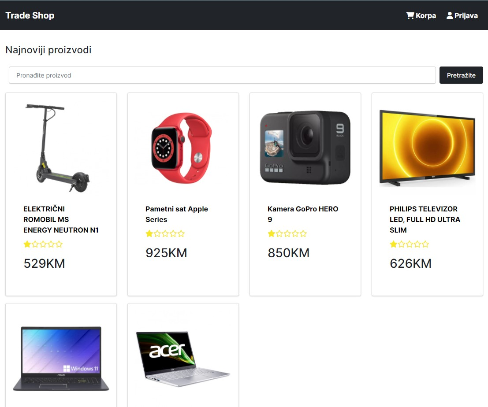

# TradeShop

---

### Aplikacija postavljena na Render platformi
### Link - [TradeShop](https://tradeshop.onrender.com)

### Note
Since application is deployed on Render using free plan here is what you need to know: "A free plan will spin down after 15 minutes of inactivity, and the next request will spin it back up, which can take around 30 seconds".

---

## Karakteristike

- Implementacija trgovinske korpe
- Implementacija procesa naplate
- Integracija PayPal API-a
- Proizvodi
  - Dohvatiti sve prozivode - /api/v1/products  /GET
  - Dohvatiti pojedini proizvod - /api/v1/products/:id  /GET
  - Obrisati proizvod - /api/v1/products/:id  /DELETE
  - Kreirati proizvod - /api/v1/products  /POST
  - Ažurirati prozivod - /api/v1/products/:id  /PUT
  - Pretraživanje proizvoda
- Autentifikacija
  - Registracija korisnika - /api/v1/auth/register  /POST
  - Prijava korisnika - api/v1/auth/login  /POST
  - Ažuriranje korisnika
- Admin
  - Dohvatanje svih korisnika
  - Dohvatanje pojedinog korisnika
  - Ažuriranje korisnika
  - Brisanje korisnika
- Nardužbe
  - Kreiranje narudžbe - /api/v1/orders  /POST
  - Dohvatanje svih narudžbi - /api/v1/orders  /GET
  - Dohvatanje pojedine narudžbe - /api/v1/orders/:id  /GET
  - Ažuriranje narudžbe - /api/v1/orders/:id  /PUT
  - Brisanje narudžbe - /api/v1/orders/:id  /DELETE
- Recenzije
  - Dodavanje recenzije - /api/v1/products/:id/reviews  /POST
  - Brisanje recenzije - /api/v1/reviews/:id  /DELETE
  - Dohvatanje recenzije za proizvod - /api/v1/products/:id/reviews  /GET

---

## Licenca

MIT Licenca

Autorsko pravo(c) Kenan Dropić.
